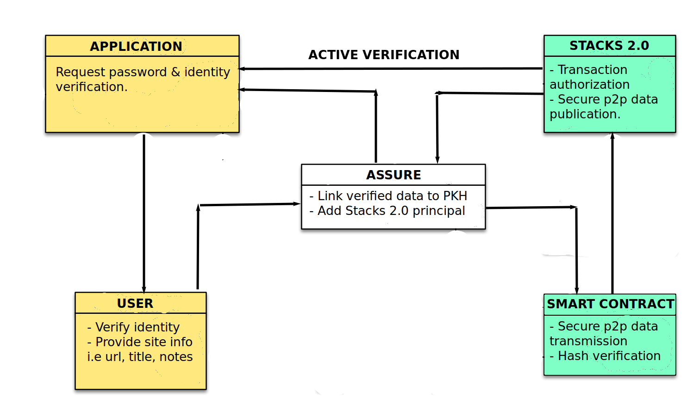

 
## Assure Manager

Assure is an open-source password manager which helps users store password in a secure database. 

Database files are encrypted and store on the Blockstack, Stacks 2.0 network using secure encryption algorithms like `AES 256`. With a single master key, users can use the browser extension to:

- Unlock the database
- add/modify verifed data
- encrypt & decrypt keys
- store & retrieve passphrases

### Project Map

In addition to the application `src` files, we've written simple Clarity smart contracts that run on Stacks 2.0's Testnet.  contracts, beginner, intermediate or advanced, run on Blockstack. 

    .
    +-- site-map
    |    +-- src (All browser extention & application files, assets & page-templates)
    |    +-- contracts (Functional core & base function clarity smart contracts)
    |    +-- test (Combines into tests the properties & functions of the contracts)  

## Getting Started

Go to [Contracts](./contracts) for a guide to compiling and running the documented smart contracts. Visit [tests](./tests) for instructions on installing dependancies and running contract tests. 

You can also create a development environment with Gitpod to build and test the contracts. 
Happy Hacking!

